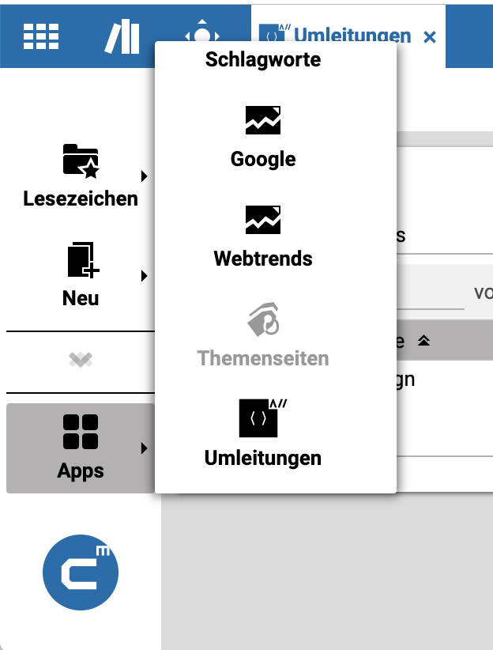
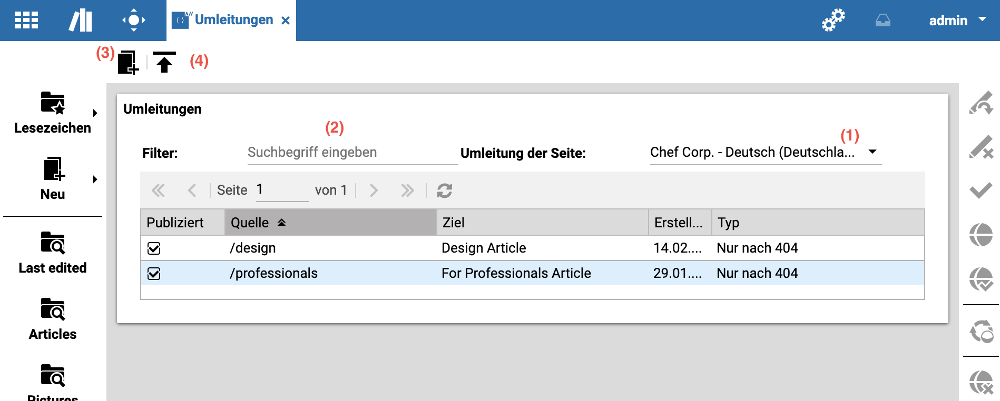
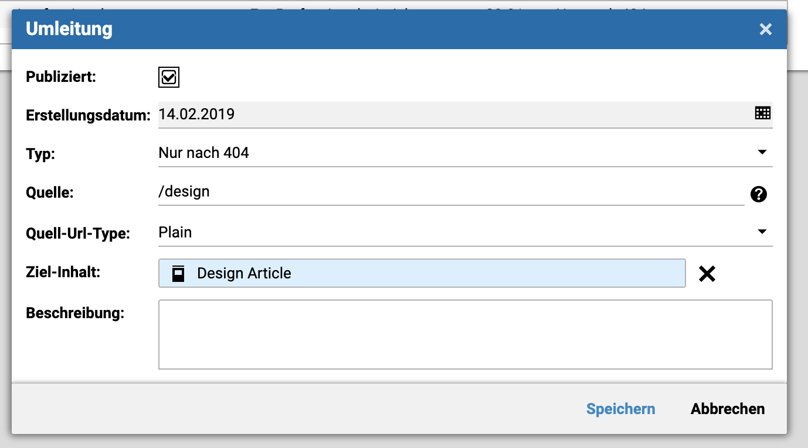

Core Redirects User Guide
=========================

The administration of redirects is handled in CoreMedia Studio. The interface can be found by clicking the Redirects
button in the apps menu:

Which leads to this view of all redirects:

Here you can select a site (1), use a full text search filter (2), add new redirects (3) or upload CSV files with
multiple redirects for import (4). Double-clicking an entry will open an edit dialog:

Redirects contain a number of fields, some of which are only informational (marked :information_source:):

- Published: Setting or removing this checkmark will automatically publish or withdraw this redirect.
- Creation date :information_source: : Automatically filled on creation with the current date.
- Type: There are two different kinds of redirects
  - Always: This redirect will always be executed, regardless of any page that would normally be shown for this url.
  - Only after 404: These redirects will only execute, if the source url results in a 404 Not found error. This can for
    example be used to redirect from missing job descriptions to a jobs overview page.
- Source: The source path for a redirect (which url to redirect)
- Source Url Parameters: A url will only be redirected if all parameters match.
- Source Url Type. This is only visible if a user is a member of the required group:
  - Plain: Simple redirects, very fast, but only for a single source url
  - Regular Expression: Defines a rule for multiple source urls to match. Slower, but more flexible.
- Target Link: The target of the redirect (where to redirect to).
- Target Url Parameters: They will be appended to the redirect target url
- Target Url: The target of the redirect (where to redirect to). Should be used with care, because it might redirect to a non-existing page. The nice thing about linking contents is that the redirect target will exist as long as the redirect exists.
- Description :information_source: : Can be used to keep notes for this redirect. Also searchable.

Uploading Redirects
---------------------------
You can upload multiple redirects at once via a CSV file using the upload button (in the top left corner). The Uploader validates the input and lists the redirects which could not be imported.
The expected CSV format is described in the upload dialog, an example CSV can be found [here](./redirects.csv).

Considerations on Redirects
---------------------------
There are a couple of considerations to take into account when creating redirects. For one, all redirects for a site with Source Url Type "Regular Expression" are
evaluated on every request (in order to check if any match). So having a lot of these rules can slow down the site.
Also: The tool tries to
[check for rules, that shadow each other][edit-validation] (have the same source url), but not every condition can be
checked, so this is a possible cause for errors. It is also possible to create redirect loops (where A -> B -> C -> A) 
which will end with a browser error (Too many redirects).

So please think before you redirect. 

[edit-validation]: core-redirects_validation.png  "Edit validation"
